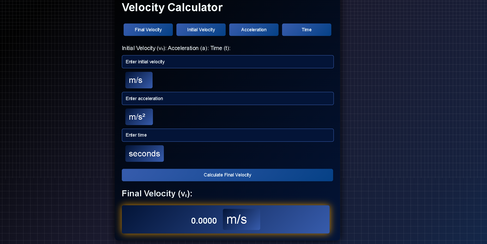

# Velocity Calculator ⚡️

[🚀 **Live Demo Here!**](https://raimonvibe.github.io/Velocity-Calculator/)

---

## 📂 Project Overview

The **Velocity Calculator** is an intuitive tool designed to simplify the process of calculating velocity, acceleration, and time using fundamental physics formulas. 🌟

### Features ✨
- **Dynamic Tab System:** Easily switch between tabs for Final Velocity, Initial Velocity, Acceleration, and Time.
- **Unit Selection:** Support for multiple units like m/s, km/h, ft/s, and more.
- **Instant Calculation:** Automatic updates upon input changes.
- **Stylish Interface:** Responsive design with a clean and modern UI.

---

## 📦 How to Use the Project

1. **Download the ZIP file** and extract it.
2. Open the `index.html` file in your favorite browser.
3. Interact with the tabs to perform calculations.
4. Select units and enter values as needed.

---

## 🛠️ Project Structure

### Files Included
- **`index.html`**: The main webpage with structured HTML for the calculator.
- **`styles.css`**: Styling for a sleek, responsive user interface.
- **`acceleration.js`**: JavaScript logic for calculations and dynamic interactivity.

---

## 🌟 Contributing
Contributions are welcome! Here’s how you can help:
1. Fork the repository.
2. Create a new branch.
3. Make your updates or fixes.
4. Submit a pull request.

Let’s improve this tool together! 🙌

---

## 📧 Contact
For questions or feedback, feel free to reach out:
- **Email**: [info@raimonvibe.com](mailto:info@raimonvibe.com)
- **Website**: [raimonvibe](https://www.raimonvibe.com/)

---

Enjoy your journey into the world of physics! 🌌
